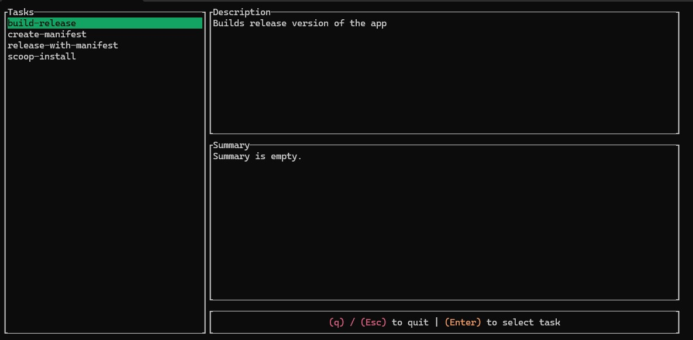

This is a personal project that implements TUI for taskfile.

The program reads `Taskfile` in current or `$HOME` directory and outputs a list of available tasks with their description and summary. Selecting a task name calls the task with this name.

Accepts `-g` flag to look for global taskfile.

